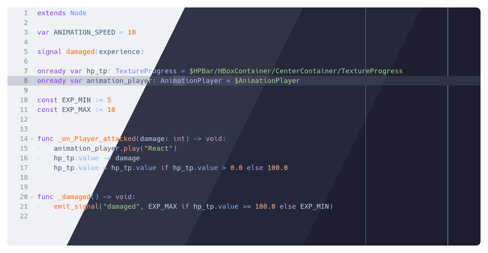
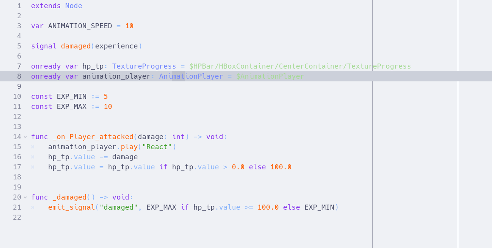
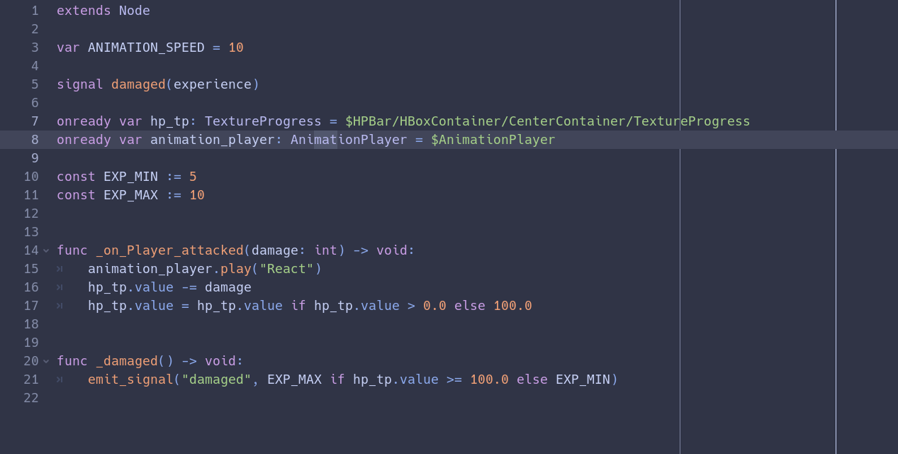
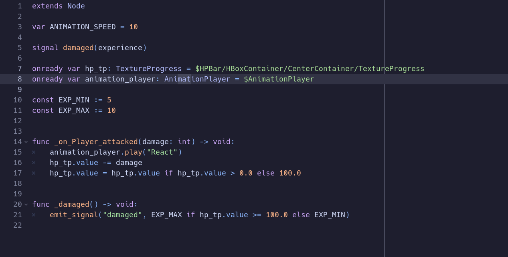

<h3 align="center">
	 
	
	Catppuccin for <a href="https://godotengine.org/">Godot</a>
	
</h3>

	
	
	

	

## Previews

🌻 Latte

🪴 Frappé

🌺 Macchiato

🌿 Mocha

## Usage

1. Clone this repository locally
2. Place the `.tet` files in your Godot text editor theme directory:
      - On Linux: `~/.config/godot/text_editor_themes/`
      - On macOS: `~/Library/Application Support/Godot/text_editor_themes/`
      - On Windows: `%APPDATA%\Godot\text_editor_themes\` 
3. In Godot engine go to Editor -> Editor Settings -> Theme
4. Choose your flavour.

## 🙋 FAQ

-	Q: **_"It this compatible for godot 4.x ?"_**\
	A: No, but work on it soon.

&nbsp;

	

	Copyright &copy; 2021-present <a href="https://github.com/catppuccin" target="_blank">Catppuccin Org</a>

	

