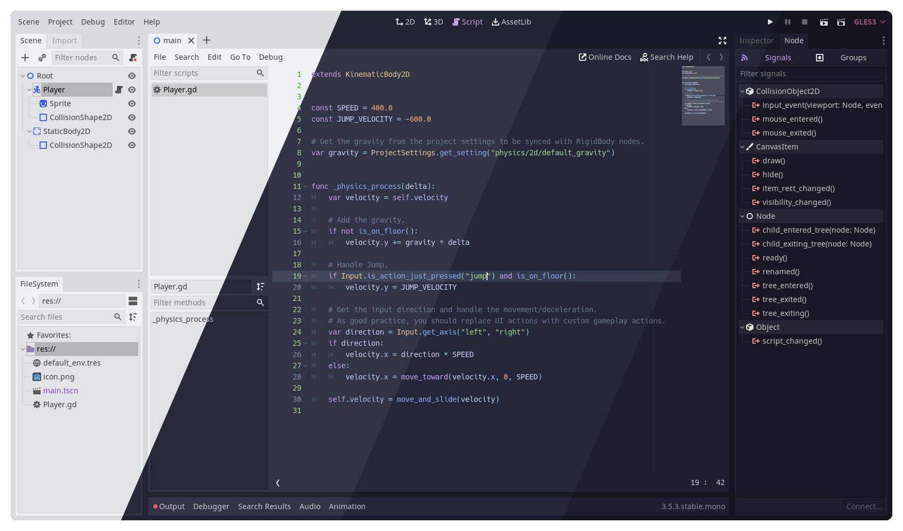
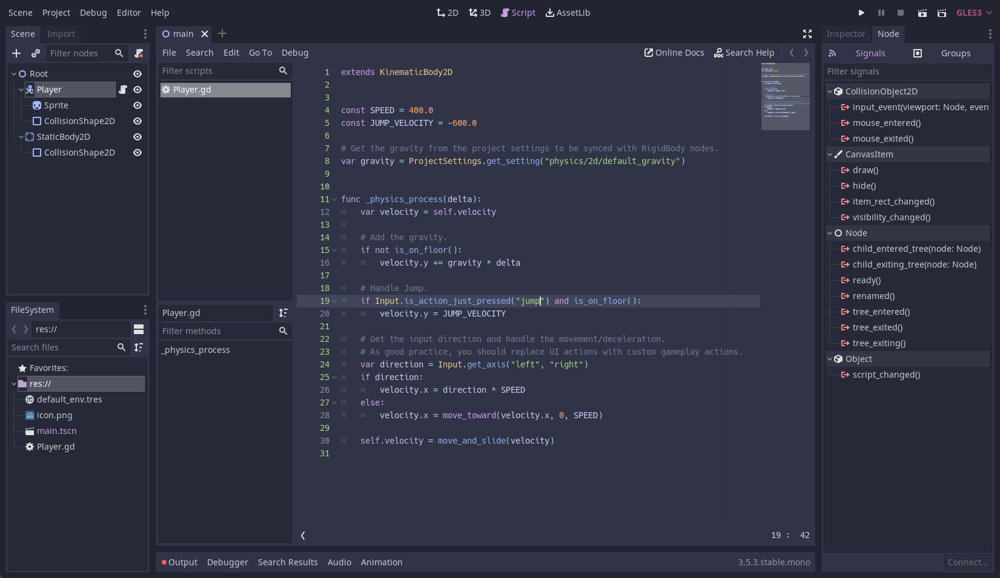
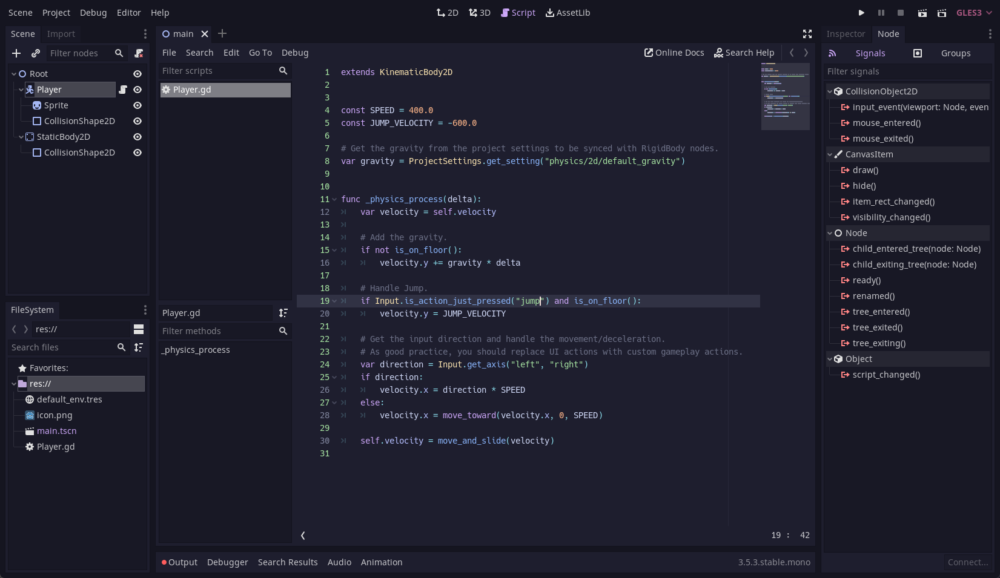

<h3 align="center">
	<br/>
	
	Catppuccin for <a href="https://godotengine.org/">Godot</a>
	
</h3>

<p align="center">
	<a href="https://github.com/catppuccin/godot/stargazers"></a>
	<a href="https://github.com/catppuccin/godot/issues"></a>
	<a href="https://github.com/catppuccin/godot/contributors"></a>
</p>

<p align="center">
	
</p>

## Previews

<details>
<summary>🌻 Latte</summary>

</details>
<details>
<summary>🪴 Frappé</summary>

</details>
<details>
<summary>🌺 Macchiato</summary>

</details>
<details>
<summary>🌿 Mocha</summary>

</details>

## Usage

> [!NOTE]
> This theme is for Godot 4. For Godot 3 support, use the [godot3 branch](https://github.com/catppuccin/godot/tree/godot3)

### Text Editor Theme

#### Official Collection

Catppuccin is available in the [Godot Syntax Themes repository](https://github.com/godotengine/godot-syntax-themes), installation instructions are in the readme.

#### Manual Installation

1. Download the [`.tet` files](themes/) for the flavour(s) you want into Godot's text editor themes directory:
	- Linux: `~/.config/godot/text_editor_themes/`
	- macOS: `~/Library/Application Support/Godot/text_editor_themes/`
	- Windows: `%APPDATA%\Godot\text_editor_themes\` 
	- Steam: `steamapps/common/Godot Engine/editor_data/text_editor_themes/`
2. In Godot, go to Editor → Editor Settings → Text Editor → Theme
3. Choose your flavour in the Color Theme dropdown.

### Interface Theme

1. In Godot, go to Editor → Editor Settings → Interface → Theme
2. Use the following settings:
	- Base Color:
		- Latte: `#eff1f5`
		- Frappé: `#303446`
		- Macchiato: `#24273a`
		- Mocha: `#1e1e2e`
	- Accent:
		- Latte: `#8839ef`
		- Frappé: `#ca9ee6`
		- Macchiato: `#c6a0f6`
		- Mocha: `#cba6f7`
	- Contrast:
		- Latte: `0.06`
		- Mocha/Macchiato/Frappé: `0.2`
	- Icon Saturation:
		- Latte: `1.0`
		- Mocha/Macchiato/Frappé: `0.6`

## Customization

The text editor themes are generated from a [template file](godot.tera). You can customize the themes by editing the template file and running [catppuccin/whiskers](https://github.com/catppuccin/whiskers):

```shell
whiskers godot.tera
```

## 💝 Thanks to

- [Boranroni](https://github.com/boranroni)
- [backwardspy](https://github.com/backwardspy)

&nbsp;

<p align="center">
	
</p>

<p align="center">
	Copyright &copy; 2021-present <a href="https://github.com/catppuccin" target="_blank">Catppuccin Org</a>
</p>

<p align="center">
	<a href="https://github.com/catppuccin/catppuccin/blob/main/LICENSE"></a>
</p>
